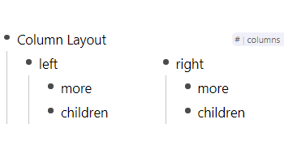

# Column Layout

## Usage

- Use the tag `#columns` to create a columns.
- Since columns are just rem they still behave like they would do without the style:
  - Move columns with <kbd>Alt</kbd> + <kbd>Up</kbd>/<kbd>Down</kbd>
  - Indenting a column turns it into a child of the previous one.
  - Dedenting a child of a column turns it into a column itself.

## Changelog

- 0.0.1: First Release!
