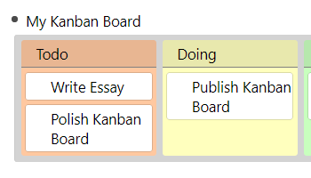

# RemNote Library Package Name

## Custom CSS Scroll manifest

- Make a demo file with the markup of some rems demonstrating your change.

Use everything below as a template for the actual content.

The README is the help page of the plugin. Here you can

- document usage instructions
- show a larger demo
- have a changelog

## Usage

If it is not obvious, document how to use here:

## Changelog

- 0.1.0: First Release!