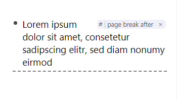

# Print Helper

## Usage

- Force page breaks with `#page break after` or `#page break before`
- Optional: Hide bullet points.
- Optional: Remove or change indentation.

## Development

You can turn on the print stylesheet in DevTools > Rendering > Emulate CSS media type.
You may have to enable the Rendering panel in ⠇ > More tools first.

## TODO

- [ ] Fit it better on the page. In my test there were no margins on the paper.
- [ ] Make references and tags more printer friendly?

## Changelog

- 0.0.1: First Release!
