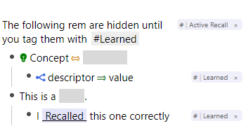

# Active Recall

Do your initial learning with active recall directly inside your notes.
After that you will have an easier time in the queue.

You can recall Concepts, Descriptors, Questions and the items of Multilines, Lists and Sets.

## Usage

- Tag an ancestor of the rems you want to learn with `#Active Recall`. All answers below that rem will be hidden.
  - Note: Currently only the forwards direction is supported.
- Create a rem with the text `Learned`.
  - You can hover over a rem or focus it to show the answer.
  - Tag it with `#Learned` to mark correctly recalled cards. Their answer will be permanently revealed.
  - It is convenient to copy this tag with <kbd>Ctrl</kbd> + <kbd>Shift</kbd> + <kbd>S</kbd> and just paste it into correctly recalled cards.
- After your learning session you can delete the rem `Learned` and all tags will be deleted as well.

## Changelog

- 0.0.1: First Release!
