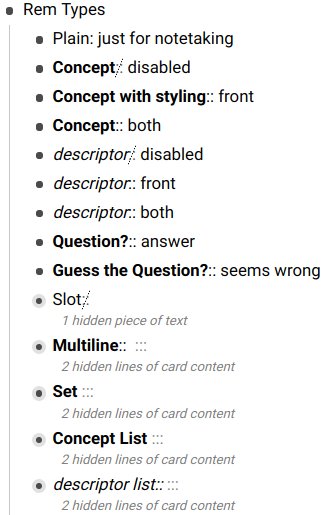
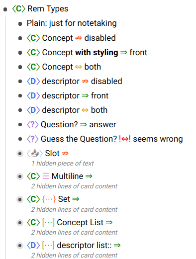

# RemNote Card Type Styles

A Custom CSS for [RemNote](https://www.remnote.io/) to change how flashcard generating rems look.

**Quickstart:**

```css
@import URL("https://hannesfrank.github.io/remnote-css-rem-types/everything.css");
```

 

**Features:**

Visual indications for:

- practice direction
- rem types (plain, multi-line, list, set)
- card types (concept, descriptor, question [and slot]).

Allow custom text styling by resetting format for concept (bold) and descriptor (italic).

**Note:** There are still some glitches as the RemNotes markup is not easy to handle.

## Installation

The style consists of multiple modules of which you can chose the parts you want to enable:

- `practice-direction.css`: arrows (⇔, ⇏) instead of `::`
- `rem-type*.css`: Icons for Concept, Descriptor, Question and Slot. There are 2 variants of which you can chose one:
  - `rem-type.css`: Using RemNotes SVG icons.
  - `rem-type-simple.css`: Use `<C>`, `<D>`, `<Q>` and `<S>`.
- `card-type.css`: Icons for Multiline, List, Set.
- `text-style.css`: Disable bold/italic formatting for concept, question and descriptor.

- Open the `Custom CSS` page in RemNote.
- Create a new blank template block.
- Paste the layout
  1.  **Recommended:** Include everything with default settings. This way you get all future updates.
      ```css
      @import URL("https://hannesfrank.github.io/remnote-css-rem-types/everything.css");
      ```
  2.  **Custom:** Only include the features you like.
      ```css
      @import URL("https://hannesfrank.github.io/remnote-css-rem-types/practice-direction.css");
      @import URL("https://hannesfrank.github.io/remnote-css-rem-types/rem-type.css");
      /* OR: @import URL("https://hannesfrank.github.io/remnote-css-rem-types/rem-type-simple.css"); */
      @import URL("https://hannesfrank.github.io/remnote-css-rem-types/card-type.css");
      @import URL("https://hannesfrank.github.io/remnote-css-rem-types/text-style.css");
      ```
  3.  **Expert:** You know CSS and want to tweak specific parts? Copy the code directly from the files above.

**Note:** If you do not want to get bothered by future updates or want to install a develop version from another branch, you can import a specific version with jsdelivr

```css
@import URL("https://cdn.jsdelivr.net/gh/hannesfrank/remnote-css-rem-types@8fe69d0/card-types.css");
```

## Known Issues

Mouse hovering:

- RemNote uses more complex the markup if you hover a Rem or focus it for editing. It gets more complex if the Rem is broken down into multiple segments, e.g. if you use formatting (bold, line breaks, ...). This is really hard (or impossible) to style properly. Therefore I disabled most things if you edit the Rem. I don't know how to detect the hover state though.
- Somethimes the markup does not get reverted if the mouse leaves a Rem. Hovering again fixes this usually.

If you know a way to fix this, great! Please open an issue or, if you can fix this a Pull Request.

See also my [development notes](./notes.md).

## Contributing

I am not a designer. This is just a proof of concept.
If you have a good design, feel free to open an Issue to discuss.

If you can improve something a Pull Request is very welcome!

### Developing with Live Reload

Setup a workspace in Chrome DevTools. See e.g. [StackOverflow: How to save CSS changes of Styles panel](https://stackoverflow.com/questions/6843495/how-to-save-css-changes-of-styles-panel-of-chrome-developer-tools).

- Serve the project folder on e.g. `localhost:5500`. I don't know yet if this has to be a live server, but probably not as Chrome accesses the file system directly.
- Add the styles in development to RemNote like this:

```
@import URL("http://127.0.0.1:5500/practice-direction.css");
@import URL("http://127.0.0.1:5500/rem-type.css");
@import URL("http://127.0.0.1:5500/card-type.css");
@import URL("http://127.0.0.1:5500/text-style.css");
```

- Open DevTools > Sources > Filesystem and add the project folder as a workspace using the little `+`. The icon of the corresponding `.css` files should have a little green circle now and hovering over the icon shows how they are linked.
- You can edit now both in your editor and in DevTools. I recommend enabling autosave in your text editor.
