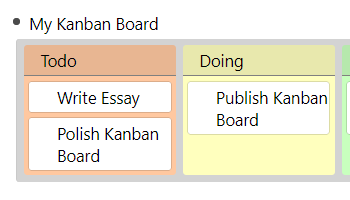
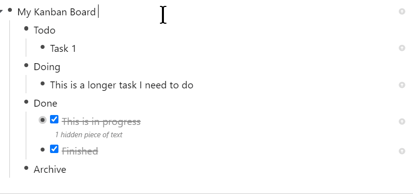

# Kanban Board

## Usage

- Use the tag `#kanban` to create a board.
- Since boards and cards are just rem they still behave like they would do without the style:
  - Move cards and boards with <kbd>Alt</kbd> + <kbd>Up</kbd>/<kbd>Down</kbd>
  - "Indenting" a board turns it into a card.
  - "Dedenting" a card turns it into a board.
  - You have to drop cards on the board title or next to another card. Watch out for the drag&drop indicators here.
  - Moving a card from one board to another does not change it, i.e. it never checks a task off automatically.

## Changelog

- 0.0.1: First Release!
