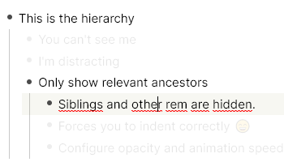

# Super Zen Mode

## Usage

- Tag the document with `#[[Super Zen]]`
- Start writing
- If you want to see everything again, remove the tag from this document.
- You can even set the opactiy to 0!

## Changelog

- 0.0.1: First Release!
